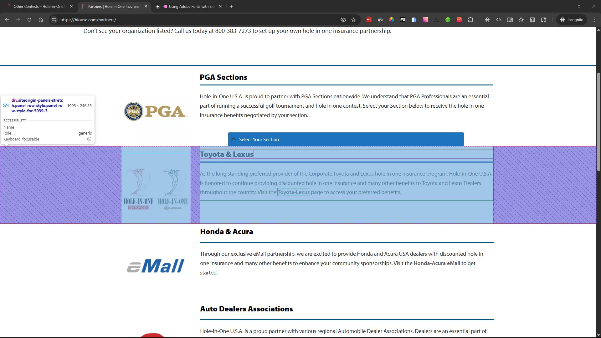
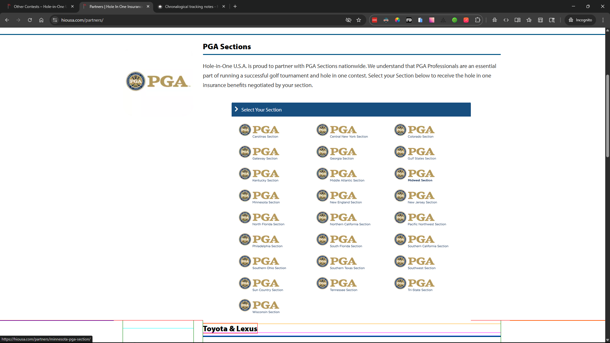

#Chronalogical tracking notes

##Thursday May 29, Setup and config.
###Morning session | My Notes
spent half a hour setting up project managment and organisation systems this morning.
### 2025-05-29 – Project Kickoff

**Focus:** Initial planning structure, milestone checklist, task breakdown, and Kanban board setup

#### ✅ Completed Tasks
- Defined planning style (hybrid)
- Confirmed update cadence (on-demand + post-milestone)
- Established preferred guidance style (questions + suggestions)

#### 🔄 In Progress
- Scoping and confirming initial milestone/subtask structure
- Reviewing site for technical audit and exact layout count

#### 📌 Next Steps
- Confirm all subtasks below are correct
- Begin Milestone 1: Site Audit & Scope Finalization

---

## 🧭 Milestone Checklist

1. Site Audit & Scope Finalization 
2. Environment Setup on WP Engine 
3. Global Styles + Header/Footer Framework (Elementor Free + UAE) 
4. Rebuild Core Pages (Home, Services, Contact, etc.) 
5. Rebuild Partner Pages (10–20 variations) 
6. Forms, Navigation, & QA 
7. Content Migration + SEO Checks 
8. Pre-Launch Finalization + Handoff 

---

## 🔍 Subtask Breakdown by Milestone

### 1. Site Audit & Scope Finalization
- [ ] Review and document all current pages and layouts
- [ ] List reusable elements (headers, footers, CTAs, widgets)
- [ ] Finalize which pages will be rebuilt vs reused
- [ ] Define scope boundaries and client expectations

### 2. Environment Setup on WP Engine
- [ ] Provision development environment
- [ ] Install WordPress + Hello Elementor theme
- [ ] Add essential plugins: Elementor, UAE, etc.
- [ ] Configure basic settings (permalinks, title, favicon)

### 3. Global Styles + Header/Footer Framework
- [ ] Define brand colors, fonts, spacing in Elementor global settings
- [ ] Create header using UAE Header Builder
- [ ] Create footer using UAE Footer Builder
- [ ] Set global templates via Elementor site settings

### 4. Rebuild Core Pages
- [ ] Home
- [ ] Services
- [ ] Contact
- [ ] About
- [ ] Gallery
- [ ] Additional unique pages (TBD after audit)

### 5. Rebuild Partner Pages
- [ ] Identify and list all partner page URLs
- [ ] Choose base layout to reuse
- [ ] Implement template
- [ ] Assign tracking-friendly unique URLs
- [ ] QA for all duplicated layouts

### 6. Forms, Navigation, & QA
- [ ] Recreate all forms using Elementor or WPForms
- [ ] Build and link site navigation (desktop + mobile)
- [ ] Manual QA: responsiveness, functionality, layout precision

### 7. Content Migration + SEO
- [ ] Migrate only in-use media
- [ ] Copy over final content blocks (text, titles, images)
- [ ] Preserve SEO metadata and URLs
- [ ] Implement redirects if needed

### 8. Pre-Launch + Handoff
- [ ] Final QA
- [ ] Client walkthrough (optional)
- [ ] Clean admin, remove unused plugins/themes
- [ ] Provide ZIP or WP login for handoff

---

## 📋 Kanban Task Tracker (Editable Markdown Format)

### 🔜 Backlog
- Finalize audit scope and count of unique layouts
- Set up WP Engine dev site
- Define global styles and design tokens

### 🚧 In Progress
- Reviewing hiousa.com for core vs. partner pages

### ⛔ Blocked
- Awaiting final content selection from client (TBD)
- Need confirmation on exact partner page count

### ✅ Done
- Planning style and cadence confirmed
- This initial task board created

---
## Page map

### Main pages
- [https://hiousa.com/](https://hiousa.com/)
- [https://hiousa.com/hole-in-one-insurance/](https://hiousa.com/hole-in-one-insurance/)
    - [https://hiousa.com/prize-package-ideas/](https://hiousa.com/prize-package-ideas/)
- [https://hiousa.com/putting-contest-insurance/](https://hiousa.com/putting-contest-insurance/)
    - [https://hiousa.com/prize-package-ideas/](https://hiousa.com/prize-package-ideas/)
- [https://hiousa.com/million-dollar-shootout/](https://hiousa.com/million-dollar-shootout/)
- [https://hiousa.com/sponsor-tee-signs/](https://hiousa.com/sponsor-tee-signs/)
    - [HIOI Sponsor Sign Info (PDF)](https://hiousa.com/wp-content/uploads/2021/05/HIOI_ponsor-Sign_Info_USA.pdf)
    - [Sponsor Sign Order Form 2022 (PDF)](https://hiousa.com/wp-content/uploads/2022/02/SponsorSignOrderForm_USA_2022.pdf)
- [https://hiousa.com/contest-insurance/](https://hiousa.com/contest-insurance/)
- [https://hiousa.com/partners/](https://hiousa.com/partners/)
- [https://hiousa.com/contact-us/](https://hiousa.com/contact-us/)
- [https://hiousa.com/faq-hole-one-insurance/](https://hiousa.com/faq-hole-one-insurance/)
- [https://hiousa.com/privacy-policy/](https://hiousa.com/privacy-policy/)

### Affiliate pages on https://hiousa.com/
Note that I broke these up into sections based on what type of page they are

#### Standard affiliate page layout
- [https://hiousa.com/partners/toyota-lexus/](https://hiousa.com/partners/toyota-lexus/)
- [https://hiousa.com/partners/honda-acura-emall/](https://hiousa.com/partners/honda-acura-emall/)
- [https://hiousa.com/partners/folds-of-honor/](https://hiousa.com/partners/folds-of-honor/)
- [https://hiousa.com/partners/gtaa/](https://hiousa.com/partners/gtaa/)

#### Nonstandard layouts
These pages generally lead to standard layouts but not always
- [https://hiousa.com/partners/marketcenter/](https://hiousa.com/partners/marketcenter/)
- [https://hiousa.com/partners/#Auto_Dealers_Association](https://hiousa.com/partners/#Auto_Dealers_Association)
- [https://hiousa.com/partners/#PGA_Sections](https://hiousa.com/partners/#PGA_Sections)
- [https://hiousa.com/partners/topgolf/](https://hiousa.com/partners/topgolf/)

### Affiliate pages on https://hiousa.com/partners/
Note that I broke these up into sections based on what type of page they are

#### Standard affiliate page layout
Note that I will put the PGA pages in their own section

- [https://hiousa.com/partners/toyota-lexus/](https://hiousa.com/partners/toyota-lexus/)
- [https://hiousa.com/partners/honda-acura-emall/](https://hiousa.com/partners/honda-acura-emall/)
- [https://hiousa.com/partners/folds-of-honor/](https://hiousa.com/partners/folds-of-honor/)
- [https://hiousa.com/partners/GTAA/](https://hiousa.com/partners/GTAA/)
- [https://hiousa.com/partners/southern-california-golf-association/](https://hiousa.com/partners/southern-california-golf-association/)

**Auto Dealers Associations**
- [https://hiousa.com/partners/minnesota-auto-dealers-association/](https://hiousa.com/partners/minnesota-auto-dealers-association/)
- [https://hiousa.com/partners/michigan-auto-dealers-association/](https://hiousa.com/partners/michigan-auto-dealers-association/)

#### Non-standard page layouts
- [https://hiousa.com/partners/marketcenter/](https://hiousa.com/partners/marketcenter/)
- [https://hiousa.com/partners/topgolf/](https://hiousa.com/partners/topgolf/)

#### PGA Pages
- [https://hiousa.com/partners/carolinas-pga-section/](https://hiousa.com/partners/carolinas-pga-section/)
- [https://hiousa.com/partners/central-new-york-pga-section/](https://hiousa.com/partners/central-new-york-pga-section/)
- [https://hiousa.com/partners/colorado-pga-section/](https://hiousa.com/partners/colorado-pga-section/)
- [https://hiousa.com/partners/gateway-pga-section/](https://hiousa.com/partners/gateway-pga-section/)
- [https://hiousa.com/partners/georgia-pga-section/](https://hiousa.com/partners/georgia-pga-section/)
- [https://hiousa.com/partners/gulf-states-pga-section/](https://hiousa.com/partners/gulf-states-pga-section/)
- [https://hiousa.com/partners/kentucky-pga-section/](https://hiousa.com/partners/kentucky-pga-section/)
- [https://hiousa.com/partners/middle-atlantic-pga-section/](https://hiousa.com/partners/middle-atlantic-pga-section/)
- [https://hiousa.com/partners/midwest-pga-section/](https://hiousa.com/partners/midwest-pga-section/)
- [https://hiousa.com/partners/minnesota-pga-section/](https://hiousa.com/partners/minnesota-pga-section/)
- [https://hiousa.com/partners/new-england-pga-section/](https://hiousa.com/partners/new-england-pga-section/)
- [https://hiousa.com/partners/new-jersey-pga-section/](https://hiousa.com/partners/new-jersey-pga-section/)
- [https://hiousa.com/partners/north-florida-pga-section/](https://hiousa.com/partners/north-florida-pga-section/)
- [https://hiousa.com/partners/northern-california-pga-section/](https://hiousa.com/partners/northern-california-pga-section/)
- [https://hiousa.com/partners/pacific-northwest-pga-section/](https://hiousa.com/partners/pacific-northwest-pga-section/)
- [https://hiousa.com/partners/philadelphia-pga-section/](https://hiousa.com/partners/philadelphia-pga-section/)
- [https://hiousa.com/partners/south-florida-pga-section/](https://hiousa.com/partners/south-florida-pga-section/)
- [https://hiousa.com/partners/southern-california-pga-section/](https://hiousa.com/partners/southern-california-pga-section/)
- [https://hiousa.com/partners/southern-ohio-pga-section/](https://hiousa.com/partners/southern-ohio-pga-section/)
- [https://hiousa.com/partners/southern-texas-pga-section/](https://hiousa.com/partners/southern-texas-pga-section/)
- [https://hiousa.com/partners/southwest-pga-section/](https://hiousa.com/partners/southwest-pga-section/)
- [https://hiousa.com/partners/sun-country-pga-section/](https://hiousa.com/partners/sun-country-pga-section/)
- [https://hiousa.com/partners/tennessee-pga-section/](https://hiousa.com/partners/tennessee-pga-section/)
- [https://hiousa.com/partners/tri-state-pga-section/](https://hiousa.com/partners/tri-state-pga-section/)
- [https://hiousa.com/partners/wisconsin-pga-section/](https://hiousa.com/partners/wisconsin-pga-section/)


### 2025-05-29 – Project Update

**Focus:** Finalized site audit and layout scope for rebuild

#### ✅ Completed Tasks
- Full site map documented and categorized
- Grouped pages by layout type (unique, standard, reusable)
- Clarified scope of PGA section rebuild and prize package page

#### 🔄 In Progress
- Preparing WP Engine Dev environment (Milestone 2)

#### 📌 Next Steps
- Begin Milestone 2: Environment Setup
- Create base Elementor template for PGA section pages
- Review layout of `prize-package-ideas/` for standalone styling

---

## 📄 Final Page Layout Summary

### 🔹 Unique Layouts (10 Pages)
- `/` (Home)
- `/hole-in-one-insurance/`
- `/putting-contest-insurance/`
- `/million-dollar-shootout/`
- `/sponsor-tee-signs/`
- `/contest-insurance/`
- `/faq-hole-one-insurance/`
- `/contact-us/`
- `/privacy-policy/`
- `/partners/` (hub page)

### 🔸 Reused Layout: Standard Affiliate Pages (~8)
- e.g. `/partners/toyota-lexus/`, `/partners/honda-acura-emall/`

### 🔸 Reused Layout: PGA Section Pages (25)
- `/partners/*pga-section/`  
- All require identical structure  
- Only per-page **API key** + **logo** differ  
- Will use a **base Elementor template**

### ⚠️ Non-Standard Pages (4)
- `/partners/marketcenter/`
- `/partners/topgolf/`
- Others with non-repeating structure

### ➕ Independent Content Page
- `/prize-package-ideas/` is a standalone page  
  - It’s **linked from multiple pages** but has its **own layout**

---

## ✅ Scope Clarifications

- Anchor links (e.g. `#Auto_Dealers_Association`) are part of `/partners/` and **not separate pages** — no rebuild required.
- All **PGA pages** will be rebuilt using a **shared template**; only small dynamic edits needed per page.
- `prize-package-ideas/` is treated as a **standalone content page**, not a reusable section.

---

## ✅ Milestone 1 – Complete

We are now ready to begin **Milestone 2: Environment Setup on WP Engine**.


### 2025-05-29 – 17:21 PT – Milestone 2 Started: Environment Setup

**Focus:** Resetting WP Engine environment and preparing clean install of WordPress for rebuild

#### ✅ Completed Tasks
- Locked final site layout count and rebuild scope (Milestone 1)
- Chose to start with a fresh WordPress install on WP Engine

#### 🔄 In Progress
- Wiping existing WP content, config, and database
- Installing WordPress and configuring initial settings

#### 📌 Next Steps
- Install core plugins (Elementor, UAE, WPForms)
- Set up Hello Elementor theme
- Prepare global settings (colors, fonts, spacing)

---

## 🧼 Environment Reset Plan

### 1. Reset WP Engine Dev Environment
- [ ] Use WP Engine “Reset Environment” feature or manually:
  - Delete `/wp-content` folder via SFTP
  - Remove `wp-config.php` customizations
  - Clear database tables (via phpMyAdmin or WP CLI)

### 2. Fresh WordPress Setup
- [ ] Reinstall latest WordPress version
- [ ] Set permalink structure to `/%postname%/`
- [ ] Remove default content and themes/plugins

### 3. Install Core Plugins
- [ ] Elementor (Free)
- [ ] Ultimate Addons for Elementor (UAE)
- [ ] WPForms Lite (or Formidable Forms)
- [ ] SEO plugin (optional)
- [ ] WP Reset (optional, for quick wipes during dev)

### 4. Theme & Settings
- [ ] Activate Hello Elementor theme
- [ ] Set site language, timezone, and favicon
- [ ] (Optional) Enable maintenance mode during dev

---

##Random non gpt notes
9:50 PST I used “Export Media Library” by Mass Edge Inc. to export the entire media library from the staging env while I am waiting for the dev env to finesh reseting. I exported them as a zip file to my local downloads.
The current system uses Quick Rdirects plugin to manage all of its redirects so I exported all of the redirects as a PIPE seperated text file again I sent this to my downloads folder.

## 2025-05-29 – 20:48 PT – Milestone 2 Logged: Full Dev Environment Reset Completed

**Focus:** Resetting WP Engine Dev environment and preparing clean WP install for rebuild

#### ✅ Completed Tasks
- Created backup of existing dev environment
- Dropped all database tables in `wp_hiousadev`
- Connected via SFTP using FileZilla
- Deleted core WP folders and root-level files
- Reconfigured FileZilla for optimal transfer performance
- Engaged WP Engine support to finalize full reset
- Logged into clean WordPress install and began base configuration

#### 🔄 In Progress
- Installing base plugins and setting up Elementor global styles

#### 📌 Next Steps
- Configure global site values (color palette, fonts, spacing)
- Build header and footer templates using UAE
- Begin Milestone 3: Global Styles + Header/Footer Setup

---

## ✅ Reset & Clean Rebuild Setup – Timeline Summary

⏱️ Estimated Duration: ~2.5 to 3 hours

| Step | Action | Time | Timestamp |
|------|--------|------|-----------|
| 1 | Backup created via WP Engine | ~5 min | T+0:00 |
| 2 | Dropped all DB tables via phpMyAdmin | ~5 min | T+0:05 |
| 3 | Connected via SFTP using FileZilla | ~15 min | T+0:10–0:25 |
| 4 | Deleted `/wp-admin/`, `/wp-includes/`, `/wp-content/`, and root files | ~45 min | T+0:25–1:10 |
| 5 | Optimized FileZilla settings | ~10 min | T+1:10–1:20 |
| 6 | Retried wp-content deletion (failed) | ~10 min | T+1:20–1:30 |
| 7 | Contacted WP Engine support and submitted reset request | ~30 min | T+1:30–2:00 |
| 8 | WP Engine reset environment successfully | ~10 min | T+2:00–2:10 |
| 9 | Logged into clean WP site and configured settings | ~20 min | T+2:10–2:30 |

---

## 🧼 Final Status

- ✅ Clean WP install on WP Engine (`hiousadev`)
- ✅ No leftover files or DB clutter
- ✅ Ready to rebuild using Hello Elementor + UAE

### 2025-05-29 – 21:07 PT – Milestone 3 Started: Global Styles & Template Framework

**Focus:** Initiated foundational style setup (colors, fonts, spacing) and base template structure in Elementor

#### ✅ Completed Tasks
- Completed WP Engine dev reset and clean install (Milestone 2)
- Logged in to WP and began transferring media assets

#### 🔄 In Progress
- Uploading media assets to WordPress Media Library
- Preparing global styles (color palette, typography)
- Planning header and footer layout using UAE

#### 📌 Next Steps
- Finalize Elementor site-wide global colors and fonts
- Create header template with UAE (sticky + responsive)
- Create footer template with UAE (navigation + contact + legal links)
- Save templates for reuse across the rebuild

---

## 🎨 Milestone 3 – Global Styles + Header/Footer Framework

### 1. Global Style Configuration
- [ ] Define brand color palette (Hex or theme color names)
- [ ] Set up font pairings (headings + body text)
- [ ] Set base spacing system (section padding, column gap, margins)
- [ ] Configure Elementor global settings

### 2. Header Template (UAE Builder)
- [ ] Build responsive header structure (logo, nav, CTA)
- [ ] Enable sticky behavior (optional)
- [ ] Mobile-friendly menu toggle

### 3. Footer Template (UAE Builder)
- [ ] Add 2–3 column layout (nav links, contact, logo, copyright)
- [ ] Insert privacy policy / terms links
- [ ] Ensure mobile responsiveness

---

## 🎨 Global Style Guide – hiousa.com (for Hello Elementor Theme)

### 1. Typography

- **Font Family:** `'Open Sans', sans-serif`
- **Heading Font Weights:**
  - `h1`–`h3`: `700` (bold)
  - `h4`–`h6`: `600` or `normal`
- **Body Text Size:** `16px`
- **Line Height:** ~`1.5em` (approx. 24px)

---

### 2. Color Palette

- **Primary Color (Buttons, Links, Accents):** `#c8102e` (bright red)
- **Secondary Color:** `#002855` (navy blue)
- **Text Color:** `#333333`
- **Background Color:** `#ffffff`
- **Header Background:** `#002855`
- **Footer Background:** `#f8f8f8`

---

### 3. Links

- **Text Links:**
  - Color: `#c8102e`
  - Hover: underline
- **Menu Items:**
  - Text Color: `#ffffff`
  - Background Hover: `#c8102e`

---

### 4. Buttons

- **Primary Button:**
  - Background: `#c8102e`
  - Text: `#ffffff`
  - Padding: `12px 25px`
  - Border Radius: `4px`
  - Hover: subtle darkening or shadow
- **Secondary Button:**
  - Background: transparent or white
  - Border: `1px solid #c8102e`
  - Text: `#c8102e`

---

### 5. Layout and Spacing

- **Section Padding:** `60px top & bottom`
- **Container Max Width:** `1170px`
- **Grid Gaps / Column Spacing:** `30px`

---

### 6. Forms

- **Input Field Styling:**
  - Border: `1px solid #cccccc`
  - Border Radius: `4px`
  - Focus Color: `#c8102e`

---

### ✅ Elementor Site Settings Suggestions

#### Global Colors
- `Primary`: `#c8102e`
- `Secondary`: `#002855`
- `Text`: `#333333`
- `Background`: `#ffffff`
- `Accent`: `#f8f8f8`

#### Global Fonts
- **Font:** `'Open Sans', sans-serif`
- **Base Text Size:** `16px`
- **Line Height:** `1.5`
- **Headings Weight:** `700` (h1–h3), `600` (h4–h6)

##UAE Header
I am working on the header template right now. I had to add the other header pages to get them to show. 
- header max height 135px
- nav bar 
I have been having a really hard time with the header styling due to the weird and convaluded application of css including a lot of use of the `!important` tag... I actually built a google exstinsion to help me visulize it. 
okay after a lot of trial and error I was able to get the purely asthetic part of the header looking correct. Now I need to get the drop down to style right and the buttons

Ok got it now I am on to the footer.
I am wrapping up with the footer for the evening. I have the basic layout setup but am having some trouble with the social icons

### 2025-05-29 – 21:42 PT – Font Integration + Milestone 3 Progress Catch-Up

**Focus:** Integrated Myriad Pro via Typekit workaround and progressed toward header/footer design foundation

#### ✅ Completed Tasks
- Completed media upload to WordPress
- Integrated Myriad Pro using Typekit plugin workaround
- Began configuring Elementor Global Styles

#### 🔄 In Progress
- Finalizing font and color variables in global styles
- Designing header and footer templates in UAE
- Reviewing layout spacing and mobile behavior

#### 📌 Next Steps
- Confirm final global color palette (Hex or CSS vars)
- Build header: logo, nav, CTA, mobile toggle
- Build footer: contact info, nav, legal, logo

---

## 🔡 Font Setup Note: Myriad Pro (via Typekit Workaround)

- Plugin Used: **Custom Adobe Fonts (Typekit)**
- Method:
  - Extracted CSS project ID from known Typekit embed URL:  
    `https://use.typekit.net/fqf3yti.css`
  - Entered **`fqf3yti`** into the plugin’s “Project ID” field
  - Font now globally available in Elementor as **Myriad Pro**
- No direct Adobe account access was required
- Fallback font stack can be set in Elementor (e.g., `Myriad Pro, sans-serif`)

---

### 2025-05-29 – 22:18 PT – Milestone 3 Status & Transition to Page Rebuilds

**Focus:** Partial completion of global style setup, header/footer templates in place, page rebuilds now underway

#### ✅ Completed Tasks
- Uploaded all media to new WordPress site
- Integrated Myriad Pro via Adobe Fonts Typekit workaround
- Built and assigned desktop versions of:
  - UAE Header (non-sticky, matching original layout and color)
  - UAE Footer (includes nav, contact, legal links, branding)

#### 🔄 In Progress
- Configuring Elementor global colors, typography, spacing (in parallel with build)
- Responsive adjustments for header and footer (mobile layout pending)
- Rebuilding individual pages based on new structure and templates

#### 📌 Next Steps
- Apply mobile responsiveness to header and footer
- Complete global button and text styles once layout patterns are established
- Continue page-by-page rebuild following layout groupings (Milestone 4)

---

## 🧩 Milestone 3 Snapshot

| Component         | Status         | Notes                                             |
|------------------|----------------|---------------------------------------------------|
| Global Colors     | In Progress    | Will be finalized as build progresses             |
| Typography        | In Progress    | Myriad Pro active, sizing/weights TBD             |
| Spacing System    | Initial pass   | Will be revised during layout tuning              |
| Buttons           | Not complete   | Global styles pending                             |
| Header (UAE)      | ✅ Desktop done | Matches original; not sticky                      |
| Footer (UAE)      | ✅ Desktop done | Fully matches original footer                     |
| Mobile Responsiveness | ❌ Not started | Needs layout review                               |
| Custom CSS        | ❌ None used    | CSS-free as of this milestone                     |

---

## 🔀 Transition to Milestone 4: Rebuild Core Pages

You are now beginning the page-by-page rebuild process.  
Let me know when you want to:
- Log your first completed page(s)
- Break down Milestone 4 into a live checklist
- Start QA passes on mobile/responsive versions

I am working on the custom quotes plugin right now. I am trying to figure out how to get it to apply. I was able to find the js document for it `quick-quotes-embed.min.js` and upload to to the root of the hiousadev site but I can not get it to apply for some reason. I am currently working with the custom html elementor block and am using the samecode that they used I though but for whatever reason I can not get it working...

## 📝 Embedding the HIOUSA Quick Quote Form in Elementor

### 🔧 How It Works
The `quick-quotes-embed.min.js` script initializes a **Web Component** called `<hio-quick-quote>`. This component renders a fully interactive quote request form powered by Angular.

### 🧩 Required HTML
To embed the form in Elementor (Free version):

```html
<hio-quick-quote sitekey="58cd8cf3-ab56-4af7-8cd4-ad62b83d9032"></hio-quick-quote>
<script src="https://hiousa.com/quick-quotes-embed.min.js"></script>
```

- Use the Elementor **HTML widget** to paste this code.
- The `sitekey` is essential; it links the form to the correct backend API.
- You **do not** need any `#quick-quote-container` div.

### 💡 Notes
- This is a **Web Component**, not a normal JavaScript form injection.
- The script looks for the `<hio-quick-quote>` tag and mounts the form inside it.
- Styling and layout can be controlled using Elementor sections and wrapping the component in a styled `<div>`.

### ✅ Example with Centering
```html
<div style="text-align:center;">
  <hio-quick-quote sitekey="58cd8cf3-ab56-4af7-8cd4-ad62b83d9032"></hio-quick-quote>
</div>
<script src="https://hiousa.com/quick-quotes-embed.min.js"></script>
```

### 🧪 Troubleshooting
- Confirm the script URL returns a valid file (no 404).
- If the form doesn’t render, open DevTools → Console and check for JS errors.
- The form **must be placed on the page before the script loads**, or re-init logic must be added manually.

---

_Last verified working on the new Elementor-based rebuild at `hiousadev.wpenginepowered.com`._

The long and short of it is that eventually I got the form working but it took a minute. Now I just have to figure out how styles are being applied it. According to the inspector it is from index in the root folder on line 125 for the header color... when I try to look at it from the devtools though it says it is unavailible and not cached... I will try to look in filezilla and see what I can find.

# 🧾 Quote Form Style Extraction and Replication – Full Documentation

## 🧭 Objective

Recreate the embedded Angular-based quote form from the original Hole-In-One USA website (`hiousa.com`) in a modern Elementor-based environment (`hiousadev.wpenginepowered.com`) using Elementor Free and UAE Header Footer Builder — achieving **pixel-perfect accuracy** and maintaining **functional parity** without compromising WordPress theme stability.

---

## 🔍 Original Source

### 📦 Script-Based Embedding

The quote form is embedded using the following directive:

```html
<hio-quick-quote sitekey="58cd8cf3-ab56-4af7-8cd4-ad62b83d9032"></hio-quick-quote>
<script src="https://hiousa.com/quick-quotes-embed.min.js"></script>
```

* The script `quick-quotes-embed.min.js` loads and renders a shadow-like Angular component.
* DOM elements and internal styles are injected dynamically.
* Styling is not isolated to a stylesheet but is instead procedurally applied via script execution.

---

## ❗ Challenges Faced

### 1. **Dynamically Generated HTML**

* The form markup is not present in the WordPress editor or Elementor backend.
* Elements like `.nav-tabs`, `.form-group`, `.form-control`, and `.btn-quote` are dynamically injected after the script executes.

### 2. **Minified and Embedded Styling**

* All form-related styling is injected via `quick-quotes-embed.min.js`, which contains both logic and styles.
* Traditional DevTools CSS file tracing showed `(index):138`, indicating inline or JS-appended stylesheets.

### 3. **Style Extraction Difficulty**

* Using `getComputedStyle` alone returned all browser-computed values — even inherited/default values — leading to extremely verbose, low-value output.
* Resulting style dumps were unmanageable: 500+ lines of irrelevant or redundant styles.

### 4. **Elementor Limitations**

* Elementor Free does not allow full HTML control inside templates.
* Solution needed to rely entirely on scoped CSS using Elementor's HTML widget or Site Settings → Custom CSS.

---

## 🧪 Strategy + Solution

### 🔧 Phase 1: DOM Capture and Comparison

* Inspected the fully rendered form via DevTools after `quick-quotes-embed.min.js` loaded.
* Captured complete DOM output of the form using `document.querySelector('hio-quick-quote').innerHTML`.
* Cross-referenced the **old site (hiousa.com)** and **new site (hiousadev.wpenginepowered.com)** side-by-side.

### 🔍 Phase 2: Smart CSS Extraction

#### Scripts Used:

**Initial script**

```js
// Logged full computed styles
const elements = document.querySelectorAll('hio-quick-quote *');
elements.forEach(el => {
  const styles = window.getComputedStyle(el);
  console.log(el.tagName, el.className, styles);
});
```

**Refined script**

```js
// Compare each element against a clean clone to get only effective styles
function getEffectiveStyles(el) {
  const defaultEl = document.createElement(el.tagName);
  document.body.appendChild(defaultEl);
  const computed = window.getComputedStyle(el);
  const baseline = window.getComputedStyle(defaultEl);

  const diff = {};
  for (let i = 0; i < computed.length; i++) {
    const key = computed[i];
    if (computed.getPropertyValue(key) !== baseline.getPropertyValue(key)) {
      diff[key] = computed.getPropertyValue(key);
    }
  }
  defaultEl.remove();
  return diff;
}
```

### 📊 Phase 3: CSS Analysis + Prioritization

* Focused only on:

  * Layout styles (widths, flex, margins, paddings)
  * Input styles (font, spacing, borders)
  * Button styles (color, hover, alignment)
  * Tab styles (`.nav-tabs`, `.nav-link.active`)

* Excluded all default tag styles (e.g. inherited line-height, overflow, etc.)

* Bundled computed CSS into `quote-form-effective-styles.json`

---

## 🎨 Final CSS Solution

Scoped styling applied only within the `hio-quick-quote` component:

```css
hio-quick-quote .quick-quotes-app {
  background: rgba(240, 247, 252, 0.85);
}

hio-quick-quote .form-container,
hio-quick-quote .quote-form-title,
hio-quick-quote .quote-management {
  padding-left: 32px;
  padding-right: 32px;
  margin-left: 32px;
  margin-right: 32px;
}

hio-quick-quote .quote-form-title {
  background-color: #d02b2f !important;
  color: #fff;
}

hio-quick-quote .btn-quote {
  background-color: #d02b2f !important;
  color: #fff !important;
}

hio-quick-quote .form-control,
hio-quick-quote .form-control-select {
  height: auto !important;
}

hio-quick-quote label {
  margin: 0.96rem 0;
  font-size: 15px;
}

.nav-tabs {
  display: flex;
  border-bottom: 1px solid #dee2e6;
  margin-bottom: 30px;
  min-height: 50px;
}

.nav-fill .nav-item {
  flex: 1 1 auto;
  text-align: center;
}

.nav-tabs .nav-item {
  margin-bottom: -1px;
}

.nav-tabs .nav-link {
  display: block;
  width: 100%;
  padding: 14px 30px;
  font-size: 16px;
  height: auto !important;
  background-color: #f1f1f1;
  border: 1px solid transparent;
  border-top-left-radius: 0.25rem;
  border-top-right-radius: 0.25rem;
}

.nav-tabs .nav-link.active {
  background-color: #fff;
  border-color: #dee2e6 #dee2e6 #fff;
  color: #000;
}
```

---

## ✅ Final Outcome

* Achieved pixel-perfect replication of the original quote form
* Scoped CSS avoids global impact across the site
* No plugin dependency or custom Elementor extensions required
* All changes are maintainable and inline-editable from within the Elementor environment

---

## 📁 Supporting Files and Scripts

| File                         | Purpose                             |
| ---------------------------- | ----------------------------------- |
| `quick-quotes-embed.min.js`  | Angular script rendering the form   |
| `old-sites-quick-quotes.css` | Computed styles from original site  |
| `New-sites-quick-quote.css`  | Computed styles from Elementor site |
| `minimal-quote-form.css`     | Final custom style snippet          |
| `style-inspector.js`         | Console tool to extract only deltas |

---

## 🔄 Next Steps

* Paste cleaned CSS in **Appearance > Customize > Additional CSS** or Elementor Site Settings.
* Test on mobile and tablet.
* Lock in fonts via Adobe Fonts (Myriad Pro) as needed.
* Back up styles in GitHub project or CSS file library.

---

*This documentation should be included in the HIOUSA Rebuild Git repo and tagged as a reference for future embedded Angular form styling work.*

### 2025-06-04 – 19:27 PT – Home Page Content Added

- The entire homepage structure has now been rebuilt inside Elementor, matching the original layout from hiousa.com section by section. All primary content blocks have been recreated using Elementor’s default widgets — including text, images, callouts, headings, and divider elements. This includes the hero image and tagline, coverage and prize explanation blocks, visual separators, testimonial area, and the final contact call-to-action. As of this point, all visible content that was part of the original homepage is now present in the rebuild.

- Special care was taken to ensure that no custom code or unnecessary plugins were introduced during this process. The structure is built entirely using native Elementor widgets to keep things as lightweight and maintainable as possible. This will also ensure future updates to Elementor and UAE remain compatible. All media files used on the homepage were uploaded earlier in the project and are now properly placed in their respective sections. The image sizes and positions are currently unstyled and will need to be adjusted during the layout phase.

- The current state of the homepage is content-complete but visually unstyled. Typography is using Elementor’s system defaults (not Myriad Pro), and spacing between elements has not yet been aligned to the legacy site. All button widgets are present but need padding, font, and color adjustments. None of the global styles have been applied yet — colors, fonts, and responsive behavior are all pending. There is no animation or motion on scroll, and mobile responsiveness has not yet been addressed. The layout currently looks functional in desktop preview mode but does not visually match the original pixel-for-pixel.

- The next phase will focus entirely on styling and refinement. The layout spacing will be adjusted to match the visual rhythm of the original site, and global styles will be applied for typography and color. Each section will be restyled individually, with attention to margin, padding, alignment, and font consistency. Mobile views will be addressed after desktop styling is finalized. Once the homepage is visually complete, we’ll move on to rebuilding the other core pages using the same system of structured, code-free Elementor blocks.


I would like to note that it would be a good idea to properly style the form at its source instead of using `!important` like we have had too. Below is the finel version of the code that I putin `Apearence > Customize > Custom CSS`

```/* ===============================
   🎯 Quick Quote Form Layout Tweaks
   =============================== */

/* Add horizontal padding to the main quote form container */
hio-quick-quote .quick-quotes-app .form-container {
    padding-left: 32px;
    padding-right: 32px;
}

/* Add margin to the quote form title block */
hio-quick-quote .quick-quotes-app .quote-form-title {
    margin-left: 34px;
    margin-right: 34px;
}

/* Add margin to the quote management section */
hio-quick-quote .quick-quotes-app .quote-management {
    margin-left: 32px;
    margin-right: 32px;
}

/* Soft blue background for the quote form container */
hio-quick-quote .quick-quotes-app {
    background: rgba(240, 247, 252, 0.85);
}

/* Adjust height for select and input fields */
hio-quick-quote .quick-quotes-app .form-control-select,
hio-quick-quote .quick-quotes-app .form-control {
    height: auto !important;
}

/* Set text and background colors for the form title */
hio-quick-quote .quick-quotes-app .quote-form-title {
    color: #ffffff;
    background-color: #d02b2f !important;
}

/* Button color styling */
hio-quick-quote .quick-quotes-app .btn-quote {
    color: #ffffff !important;
    background-color: #d02b2f !important;
}

/* Quote form label spacing and font size */
hio-quick-quote .quick-quotes-app label {
    margin-bottom: 0.96rem;
    margin-top: 0.96rem;
    font-size: 15px;
}

/* Adjust margin for error icon display */
hio-quick-quote .quick-quotes-app .material-icons.md-error {
    margin-top: 20px;
    margin-bottom: 20px;
}

/* Add top padding to date field column */
hio-quick-quote div.form-group.col.date {
    padding-top: 10px;
}

/* ===============================
   📦 Quote App Container Padding
   =============================== */

/* Extra bottom padding for the quote app */
div#pl-5 div#quick-quotes-app {
    padding-bottom: 62px !important;
}


.elementor-kit-7 a {
    line-height: 20px;
}
```

I am currently working on styling the image...

### 2025-06-04 – 19:55 PT – Full Progress Rebase Against Contract Phases

#### 🔁 Summary
This entry resets the project’s tracking against the original 5-phase contract. Each phase is listed with a detailed checklist for internal reference and scope alignment.

---

#### ✅ PHASE 1: Dev Setup & Scoping Validation – COMPLETE

**Deliverables:**
- WP Engine Dev site reset
- Clean WordPress install
- Page and layout audit complete
- Scope boundaries clarified

**Checklist:**
- [x] Created WP Engine backup before reset
- [x] Dropped database tables via phpMyAdmin
- [x] Used FileZilla to delete /wp-content/ and root files
- [x] Contacted WP Engine support to reset dev environment
- [x] Clean WP install confirmed
- [x] Installed Hello Elementor theme
- [x] Installed Elementor, UAE, WPForms
- [x] Uploaded all required media files
- [x] Integrated Myriad Pro using Adobe Fonts workaround
- [x] Created complete page map with layout categorization
- [x] Defined project scope boundaries (partner pages, SEO, CRM)

---

#### 🔄 PHASE 2: Site-Wide Layout & Design System – IN PROGRESS (~60%)

**Deliverables:**
- Global color, font, and spacing tokens created
- Header and footer templates built using UAE
- Design system foundation laid

**Checklist:**
- [x] UAE Header created (matches original layout, not sticky)
- [x] UAE Footer created (includes nav, contact, legal links)
- [x] Myriad Pro active via Typekit CSS ID
- [ ] Global color palette defined in Elementor settings
- [ ] Typography hierarchy configured
- [ ] Spacing rules set (padding, column gaps)
- [ ] Button styles globally configured
- [ ] Mobile header/footer styling completed
- [ ] Template assignments verified site-wide
- [ ] Global Elementor settings finalized

---

#### 🔄 PHASE 3: Core Page Rebuilds – IN PROGRESS (~10%)

**Deliverables:**
- 8 uniquely designed pages rebuilt from scratch
- SEO structure maintained
- Fully responsive layout per page

**Checklist:**
- [x] Home page content fully added
- [ ] Home page desktop styling complete
- [ ] Home page mobile responsiveness configured
- [ ] Header/footer integration verified on homepage
- [ ] Contact page created with form
- [ ] FAQ page rebuilt with toggles or anchors
- [ ] Insurance pages recreated (Hole-in-One, Putting, Million Dollar Shootout)
- [ ] Sponsor Tee Signs page rebuilt with PDFs
- [ ] Privacy Policy recreated
- [ ] Desktop and mobile styling QA for all pages

---

#### ⏳ PHASE 4: Partner Pages – NOT STARTED

**Deliverables:**
- 10–20 partner pages using shared template
- Unique quote form key + branding on each
- URL structure preserved

**Checklist:**
- [ ] Standard Elementor template created for partner layout
- [ ] Unique logo slots and API form key zone defined
- [ ] PGA pages prepared (~25 total)
- [ ] Auto Dealer pages mapped
- [ ] Pages duplicated and edited with correct data
- [ ] Noindex tags applied where appropriate
- [ ] Partner page URLs checked for match and tracking

---

#### ⏳ PHASE 5: SEO + Final QA – NOT STARTED

**Deliverables:**
- Final polish of SEO fields and responsive behavior
- QA across devices
- Handoff of site

**Checklist:**
- [ ] All headings (H1–H4) reviewed for hierarchy
- [ ] Meta titles and descriptions set per page
- [ ] Alt text applied to all key images
- [ ] Quote form tested on all partner pages
- [ ] Contact form tested for delivery
- [ ] Mobile and tablet views validated for all pages
- [ ] Performance optimized (caching, image compression)
- [ ] Unused plugins/themes removed
- [ ] Final walkthrough or client training call (optional)
- [ ] Deliverables handed off (admin access or ZIP export)


##6/10/25
I am currently working on the partners page for the site. I was able to figure out getting the correct font Myriad pro. See [the note were I detail how](../../../web-design/adobe-phonts-hack.md) for details as to how I did this. There are quite a few unexspected issues with the site and design practices that are making rebuilding it extremly diffucult. For example the first paragraph section on [the partners page](https://hiousa.com/partners/) used two different paragraph sections at the bottom just for spacing and the bottome border. It is a utter nightmare. Also there is very little of what could be called global styling outside of the font family and the border colors. I am currently working on the section directly below... We will see how it goes...

I will need to go back through and check all the links with a fine tooth comb. Right now I know that there are both styling and direction errors

I am trying to figuer out how to build this drop down in elementor... there is not a native dropdown for it so I will likely have to build a manual one...


I think I can use the acordian deal from elementor. It seems like it will work prettly well.

It is working great I just need to complet the content and the dropdowns

### 2025-06-04 – 21:42 PT – Core Page Rebuilds Nearly Complete (2 Pages Remaining)

- All major pages from **Home** through **Partners** have been rebuilt in Elementor, replicating the structure, content, and layout of the original site.
- Rebuilt pages include: 
  Home, Hole-in-One Insurance, Prize Package Ideas, Putting Contest, Million Dollar Shootout, Sponsor Tee Signs, Contest Insurance, FAQ, Privacy Policy, Contact, and Partners.
- The final two pages are still in progress and will complete the Phase 3 core rebuild milestone once finished.
- All pages are constructed using clean Elementor and UAE components — no custom CSS has been introduced.
- Visual structure is consistent and well-aligned with the legacy design.
- Global font and spacing rules are semi-consistent, but the final pass for typography, padding, button styles, and spacing is still pending.
- Internal and external links still need to be placed or re-verified across all pages.
- Quote form placeholders are in place on relevant pages, pending integration.
- Mobile responsiveness is partially addressed but will require a full device pass before final QA.

**Next Steps:**
- Finish rebuilding the final 2 pages
- Add all missing links across existing pages
- Complete final styling (font sizes, spacing, button appearance)
- Begin templating the Partner Pages (Phase 4)


I am working on finding a way to export the old contact form from the stg site and use that in the new setup. I think that the best way to do it is to just manually copy all the old form code and paste it into the new enviroment. This unfourtunatly does not bring images or other such dependencies such as styling with it however so I will likly have to add that to the custom code section. It is also likly that that I will need to install and setup the other various contact form 7 plugins that were in the old site however I am hoping to avoid that if I can. [the contact page](assets/old-contact-page.png)

##GPTs Instructions
The following is GPTs instructions for recreating the layout and styling in elementor

---
---

Perfect — here’s a **step-by-step Elementor widget layout** to recreate the HIOUSA Contact Form (with Contact Form 7) and match the styling shown in your screenshot.

---

## 🧱 Elementor Layout Structure (Free Version-Compatible)

### ✅ Layout Overview:

Use a **2-column section** inside a full-width container:

- **Left Column (33%):** Contact image + address + phone (static HTML)
- **Right Column (67%):** Contact Form 7 shortcode + heading + image

---

### 🧩 Section Setup:

#### Section:

- Layout: 2 columns (33% / 67%)
- Width: Full Width
- Gap: Default or Wide
- Padding: Top/bottom padding \~60px (or `pad-t4 pad-b4` equivalent)

---

## 📐 Column 1: Static Info (Left Side)

**Widget 1:** *Image*

- Upload logo (e.g., `/wp-content/uploads/2022/06/ezgif.com-gif-maker-15-1.webp`)
- Style: Width 300px, centered

**Widget 2:** *Button (Optional)*

- Text: `Request A Quote`
- Link: `https://hiousa.internationalholeinoneassociation.com/login`
- Style: Accent color, margin bottom \~20px

**Widget 3:** *Text Editor*

```html
<h3>6195 Ridgeview Ct., Suite A<br>Reno, NV 89519</h3>
<h2><a href="tel:+1-800-383-7273">800.383.7273</a></h2>
<h3>F: 775.852.7274</h3>
```

---

## 📐 Column 2: Contact Form (Right Side)

**Widget 1** *Image (FlagStick)*

- Image URL: `https://hiousa.com/wp-content/uploads/2022/06/ezgif.com-gif-maker-16.webp`
- CSS Class: `hio-flag`
- Centered

**Widget 2** *Heading*

- Text: `Contact Us for More Information`
- Tag: `H2`
- Alignment: Center
- CSS Class: `hio-contact-title`

**Widget 3** : *Shortcode*

- Paste the Contact Form 7 shortcode:

  ```plaintext
  [contact-form-7 id="319" title="Contact Form"]
  ```

- You can verify this ID in WP → Contact → Contact Forms.

**Widget 4 (Optional)** : *HTML* or Text widget

- Use this to add extra notes or styling hooks.

---

### 🎨 Add Custom CSS

If using Elementor Pro:

* Select the section → Advanced → Custom CSS → Paste the CSS I provided above.

If using Elementor Free:

* Paste CSS into **Appearance → Customize → Additional CSS**.
```
/* === HIOUSA Contact Form Replica === */

/* Form Wrapper Background and Layout */
.wpcf7-form {
  background-color: rgba(240, 247, 252, 0.85);
  padding: 32px;
  border-radius: 4px;
  box-shadow: 0 0 5px rgba(0,0,0,0.1);
}

/* Headline */
.hio-contact-title {
  text-align: center;
  font-size: 24px;
  color: #005483;
  font-weight: 600;
  margin-bottom: 30px;
  text-transform: uppercase;
}

/* Flag Image (Insert above the headline manually in Elementor or HTML widget) */
.hio-flag {
  display: block;
  margin: 0 auto 15px auto;
  width: 86px;
}

/* Input Fields */
.wpcf7-form input[type="text"],
.wpcf7-form input[type="email"],
.wpcf7-form input[type="tel"],
.wpcf7-form textarea {
  width: 100%;
  max-width: 100%;
  padding: 10px 12px;
  border: 1px solid #ccc;
  border-radius: 2px;
  font-size: 15px;
  margin-bottom: 15px;
  box-sizing: border-box;
}

/* Labels */
.wpcf7-form label {
  display: block;
  margin-top: 0.75rem;
  margin-bottom: 0.5rem;
  font-size: 15px;
  font-weight: 500;
  color: #333;
}

/* Submit Button */
.wpcf7-submit {
  display: block;
  width: 100%;
  background-color: #d02b2f;
  color: #ffffff;
  padding: 12px;
  border: none;
  border-radius: 2px;
  font-size: 16px;
  font-weight: bold;
  text-transform: uppercase;
  cursor: pointer;
  transition: background 0.3s ease;
}

.wpcf7-submit:hover,
.wpcf7-submit:focus {
  background-color: #b02125;
}

/* Responsive padding for small screens */
@media only screen and (max-width: 768px) {
  .wpcf7-form {
    padding: 20px;
  }
}
```

---

### ✅ Result

You’ll now have a **fully responsive**, visually matched layout:

* Brand-aligned flag image
* Red heading
* 5 field form
* Styled button
* Clean spacing
* Responsive down to mobile

---

Would you like a downloadable `.json` Elementor template file for this layout too (Pro version only)?

I am having a devil of a time properly styling the contact form however I did just find the theme editible [css file](assets/old-sites-css.txt) I think That I might go batty trying to figure this all out...
